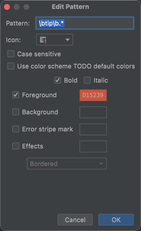

### [新前端开发指南](https://www.jianshu.com/p/87b709945757)

### 例子工程使用指南
请在上线前删除本标题下的全部内容以及demo文件夹
#### demo
本文档的图片等资源放在 demo 文件夹可以自行删除
#### 关于 TIP
在工程内有许多 TIP 来提示需要做的事情或需要修改的配置，可以通过全局搜索来查找。

webstorm 用户还可以在设置中搜索 TODO 来添加 TIP 的相关配置，这样这部分提示会被高亮。



### 工程使用说明

#### 全局安装 @f6/gaia 工具包

```shell
npm install -g @f6/gaia
```

以下命令会默认加入 F6_RUN_ENV NODE_ENV DEV_TEST_ENV 等环境变量

```typescript
const F6_RUN_ENV: string = 'test' // dev test sst sit pre trial prod
const NODE_ENV: string = 'production' // 除了 build 情况下 为production 默认为空
const DEV_TEST_ENV: string = 'test' // F6_RUN_ENV 为 dev 的情况下，用来指定本地调试的环境
```

```shell
# 启动项目 env -> DEV_TEST_ENV
gaia dev {env}

# 编译项目 env -> F6_RUN_ENV
gaia build {env}
gaia upload {env}
```

### @f6/gaia 其他命令
```shell
# gaia 当前版本
gaia -v
# gaia 安装路径
gaia -p
# gaia 自动升级（如果node环境权限有问题，可能会运行失败，可以联系共通组帮忙解决）
gaia -u

# 安装本地依赖 等同于 yarn
gaia i
gaia install
# 等同于 yarn --frozen-lockfile
gaia i -f
# 等同于 yarn --registry=https://maven.carzone365.com/repository/npm-group/
gaia i -r
# 同时需要 均可
gaia i -rf
gaia i -fr

# 检查代码是否符合基本发布规则
gaia lint
# 检查代码是否符合基本发布规则，并将结果推送到钉钉群; env 为当前执行的环境
gaia lint-ding {env}

```

### PS

请不要在不清楚的情况下自行修改package.json文件scripts中的以下默认配置

```json
{
  "serve": "vue-cli-service serve --open",
  "build": "vue-cli-service build",
  "upload": "gulp upload-oss"
}

```


### 前言

这次改造的主要目标：

1. 解决CSS样式在项目中大量重复引入的问题
2. 解决对功能样式引用不明确的问题
3. 全局样式污染问题
4. 解决代码过大，组价化程度过低的问题
5. 解决编码过程中，格式化代码问题
6. 解决eslint检查没有通过代码就上传到代码仓库
7. 文件代码分离向关注点分离过渡
8. 优化整体代码风格

***

### 技术准备

##### 基础

* ES6 http://es6.ruanyifeng.com/
* Vue.js https://cn.vuejs.org/v2/guide/
* Vue-router https://router.vuejs.org/zh/
* Vuex https://vuex.vuejs.org/zh/
* Element-ui http://element-cn.eleme.io/#/zh-CN/component/quickstart

##### 基础+

* [Pug](https://pugjs.org/api/getting-started.html) 是一款健壮、灵活、功能丰富的模板引擎,专门为 Node.js 平台开发。Pug 是由 Jade 改名而来。
* [Stylus](http://stylus-lang.com/) 是一个CSS预处理框架
* [CSS Modules](https://github.com/css-modules/css-modules) 是一个用于模块化和组合 CSS 的流行系统。
* [Git](http://git.oschina.net/progit/) 是一个免费的开源分布式版本控制系统，旨在快速，高效地处理从小型到大型项目的所有事务。

##### 进阶

* [vue-loader](https://vue-loader.vuejs.org/zh/)
* [vue-cli v3](https://cli.vuejs.org/zh/)
* [Webpack v4.x](https://webpack.docschina.org/concepts/)
* [Babel.js v7.x](https://babeljs.io/docs/en/)
* [Node.js v10.x](https://nodejs.org/dist/latest-v10.x/docs/api/)

##### 拓展

``Eslint`` ``Githook``   ``Yargs`` ``Koa``

***

#### 为什么选择pug

1. 无需结束标签 在html中，几乎每个标签都需要写相应的结束标签，这既耗费时间和精力又使代码更加冗长，而且万一忘了写结束标签会导致不可预期又难以定位的错误。相比之下，pug没有结束标签，代码更加简洁高效。
2. 强制缩进 强制缩进有人喜欢有人不喜欢，但是它带来的好处却是无可置疑的：它使得团队中所有人的风格都统一了起来，使得阅读别人的代码不再那么恐怖，让所有人都养成了缩进代码的好习惯，也减少了因为代码格式化产生的冲突等问题。

#### 为什么选择stylus

1. 语法简洁干净 语法和 Sass 有一点点类似，但是最大的特点便是没有分号，没有冒号，没有大括号，通过缩进和换行。
2. 编程式的变量调用 一切的定义方式都是按照编程的风格定义的，像编程一样的函数调用，像编程一样的变量定义，像编程一样的书写方式。
3. 语法容易上手 官方推荐的是无分号，无冒号，无大括号，但是他可以有分号，可以有冒号，也可以有大括号，也就是说你愿意的话，你完全可以当做普通的 CSS 文件来写，甚至是 Less,Sass 等其他预处理器的风格。

```stylus
// 外部变量
font-size = 14px
font = font-size "Lucida Grande", Arial

body
  font font, sans-serif

//编译前
.onemorepaddedbox
  padding-left 20px
  padding-right 30px
  width 1200px - @padding-left - @padding-right

//编译后
.onemorepaddedbox {
  padding-left: 20px;
  padding-right: 30px;
  width: 1150px;
}
```

**相关文献**
[[译]为什么使用Stylus](https://www.cnblogs.com/panew/p/4478663.html)

#### 为什么选择 CSS Modules

CSS Scoped

```
<style scoped>
.example {
  color: red;
}
</style>

<template>
  <div class="example">hi</div>
</template>
```

转换结果

```
<style>
.example[data-v-f3f3eg9] {
  color: red;
}
</style>

<template>
  <div class="example" data-v-f3f3eg9>hi</div>
</template>
```

CSS Modules

```
<template>
  <p :class="$style.red">
    This should be red
  </p>
</template>
<style module>
.red {
  color: red;
}
</style>
```

转换结果

```
<template>
  <p class="_1VyoJ-uZOjlOxP7jWUy19_0">
    This should be red
  </p>
</template>
<script>
export default {
  created () {
    console.log(this.$style.red)
    // -> "_1VyoJ-uZOjlOxP7jWUy19_0"
    // an identifier generated based on filename and className.
  }
}
</script>
<style module>
._1VyoJ-uZOjlOxP7jWUy19_0 {
  color: red;
}
</style>
```

使用CSS Modules后的变化：

* 面向组件写样式，不会影响其他样式
* 不会被全局样式污染

**相关文献：**
[vue-loader CSS Modules介绍](https://vue-loader-v14.vuejs.org/zh-cn/features/css-modules.html)
[关于CSS Modules的一些介绍和实现](https://segmentfault.com/a/1190000010301977)

***

### 开始

* 下载并安装git
* 拉工程 命令： git clone {项目地址}
* 下载并安装nodejs
* 安装yarn 命令： npm install -g yarn
* 命令：cd original
* 命令：yarn --registry=http://nexus.carzone.cn:24690/repository/npm-all/
* 命令：yarn dev

PS:实际使用中，还需要切换到开发分支。
***

### 项目结构介绍

***

### 插件支持

**提高开发效率，关注于业务本身。**
[stylus-assist](https://github.com/gucovip/stylus-assist) 辅助开发编码
[Typinator](https://www.waerfa.com/typinator-review) 辅助输入

### 格式化代码的相关配置


***

### PS

让我们尽情的享受业务和技术碰撞而迸发出的灿烂烟火吧！！
